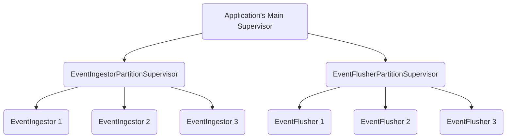

# Event[Ingestor](https://www.ssec.wisc.edu/mcidas/doc/xcd_guide/current/intro-4.html)

---
This is a demo repo to simulate an app which will ingest a high-volume of events that could come from a device, user behavior, machine on a factory floor, etc. From there, parsing, aggregation and/or persisting to a data store/event pipeline could take place. Currently, this app just outputs to Logger as I am focusing on the Supervisor setup. Different types of supervision trees are used, notably, a [PartitionSupervisor](https://hexdocs.pm/elixir/PartitionSupervisor.html) to support horizontal scaling.

>Parent Supervisor: `Application` Supervisor
>
>[PartitionSupervisor](https://hexdocs.pm/elixir/PartitionSupervisor.html)s: `EventIngestorPartitionSupervisor`, `EventFlusherPartitionSupervisor`
>
>[GenServer](https://hexdocs.pm/elixir/GenServer.html)s: `EventIngestor`, `EventFlusher(Acts like a Cronjob service)`



---
## Stress Testing
```elixir
test_events = [
  %UserEvent{id: "1", user_id: "1", action_data: [type: :knob, left: "5"]},
  %UserEvent{id: "2", user_id: "1", action_data: [type: :knob, right: "6"]},
  %UserEvent{id: "3", user_id: "1", action_data: [type: :knob, left: "8"]},
  %UserEvent{id: "4", user_id: "2", action_data: [type: :knob, left: "5"]},
  %UserEvent{id: "5", user_id: "2", action_data: [type: :knob, right: "1"]},
  %UserEvent{id: "6", user_id: "2", action_data: [type: :knob, left: "2"]}
]

# Run 100,000 simulated requests
1..100_000
|> Task.async_stream(
  fn _ ->
    # Pick a random event
    event = Enum.random(test_events)

    # Cast the event to an instance of `EventIngestor`
    EventIngestor.persist_event(event)
  end,
  # Run the tests with 2,000 concurrent process
  max_concurrency: 2_000
)
|> Stream.run()
```

---
## Inspired by
The inspiration comes from the [Elixir Patterns book, Chapter 5. Scaling up With PartitionSupervisor](https://elixirpatterns.dev/). As of this writing, _the elixirpatterns.dev site seems to be down_. 

---
To start your Phoenix server:

  * Run `mix setup` to install and setup dependencies
  * Start Phoenix endpoint with `mix phx.server` or inside IEx with `iex -S mix phx.server`

Now you can visit [`localhost:4000`](http://localhost:4000) from your browser.

Ready to run in production? Please [check our deployment guides](https://hexdocs.pm/phoenix/deployment.html).

## Learn more

  * Official website: https://www.phoenixframework.org/
  * Guides: https://hexdocs.pm/phoenix/overview.html
  * Docs: https://hexdocs.pm/phoenix
  * Forum: https://elixirforum.com/c/phoenix-forum
  * Source: https://github.com/phoenixframework/phoenix
